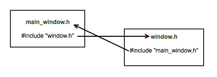
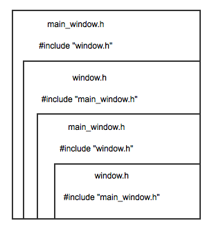

# Dependência cíclica de headers

Uma coisa que acaba atrapalhando quem está começando no C++ é a dependência cíclica dos *headers*. Quando estamos escrevendo programas minúsculos isso não acontece, mas é um cenário muito comum.

Antes de falar mais sobre as dependências, vamos entender um pouco da inclusão destes *headers*. Como funciona o famoso **#include** ?

Supondo que temos 3 arquivos: *main.cpp*, *main.h* e *int_vector.h*, com o seguinte conteúdo:

```cpp
//File main.cpp --------------------------
#include "main.h"
#include "int_vector.h"

//We're not using accumulate because our
//int_vector example doesn't support.
int get_total(const int_vector &v) {
  int total = 0;
  for(int i=0; i < v.size(); i++) {
    total += v[i];
  }
  return total;
}

//File main.h ----------------------------
int get_total(std::vector<int> &v);

//File int_vector.h ----------------------
struct int_vector {
  //implementation details ...
  int size() { return _size; }
  int operator[](int pos) { 
    return _data[pos];
  }
  int *_data;
};
```

Ao compilar o arquivo *main.cpp*, será feito um **pré-processamento** de macros (como o *#include*) e será gerado um arquivo de saída como este abaixo.

```cpp
//Resulting file after pre-processing ----
int get_total(std::vector<int> &v);

struct int_vector {
  //implementation details ...
  int size() { return _size; }
  int operator[](int pos) { 
    return _data[pos];
  }
  int *_data;
};

int get_total(std::vector<int> &v) {
  return std::accumulate(begin(v), end(v));
}
```

Então, o que seria a dependência cíclica ?

Conforme vimos, o pré-processador junta **todos** os arquivos referenciados em uma diretiva *#include* em um arquivo só. Quando um *header* inclui um outro *header* e este outro inclui o primeiro, o que o pré-processador deve fazer ?



Temos uma solução fácil para isso, mas antes vamos imaginar o seguinte cenário:
 Nós temos uma *main_window* que pode ter uma janela filha e a *main_window* vai fechar a janela.

Vamos ver uma implementação inicial desse cenário

```cpp
// ---- main_window.cpp ----
#include "main_window.h"
#include "window.h"

//My main window class
main_window mw;

//I have a close child that I want to close
mw.close_child();

// ---- window.cpp ----
#include "window.h"

void window::close() {
	//Closing window stuff...
	cout << "Closing window" << endl;
}
```

Simples e direto. A *main_window* invoca o *window::close*.

Porém, vamos supor que o fechamento dessa janela pode ser impedido, ou seja, o *window::close* talvez não seja bem sucedido e este processamento é **assíncrono**.

Para isso, é necessário alertar o *main_window* que a janela foi fechada com sucesso.

```cpp
void window::close() {
	//Closing window stuff...
	if( msgbox::inform("Really?") ) {
		cout << "Closing window" << endl;
		
		//Closing window stuff
		//...
		
		//Now I need to inform the main window 
		//closing succeeded 
	} else {
		cout << "Thanks for this 2nd chance!" << endl;
	}	
}
```

Neste caso, é preciso que o *main_window* conheça o *window*, uma vez que vai ser invocado o *close*, mas também é preciso que o *window* conheça o *main_window*, já que ao ser invocado, ele vai alertar que *window::close* foi bem sucedido.

Uma forma inicial é:

```cpp
//File main_window.h --------------------
#pragma once

#include "window.h"

struct main_window {
	void close_child();
private:	
	window child;	
};

//File window.h -------------------------
#pragma once

#include <string>
#include "main_window.h"

struct window {
	window(main_window &parent) : _parent(parent) { }
	void close();
private:
	main_window &_parent;
};
```

Isso gera o problema de dependência cíclica, já que temos:

- *main_window.h* incluindo o *window.h*
- *window.h* incluindo o *main_window.h*
- E assim indo sucessivamente, para todo o sempre.



**Solução do problema**

Para resolvermos este problema, precisamos definir um tipo **incompleto** (*forward declaration* na terminologia do C++)

```cpp
struct main_window;

struct window {
	window(main_window &parent) : _parent(parent) { }
	void close();

private:
	main_window &_parent;
};
```

A linha *struct main_window* declara que uma classe incompleta *main_window* existe e será declarada posteriormente. Por ser um tipo incompleto, o  compilador não conhece o seu tamanho, então somente temos esse  tipo incompleto na forma de ponteiro ou referência.
 **Ex: main_window &_parent ou \*_parent**

Na implementação é preciso fazer o *include* do *window.h* para que este saiba onde encontrar o *layout* da classe incompleta usada

```cpp
#include "window.h"
#include "main_window.h"

void window::close() {
	//Closing window stuff...
	
	if( msgbox::inform("Really?") ) {
		cout << "Closing window" << endl;
		_parent.inform_closed(this);
	} else {
		cout << "Thanks for this 2nd chance!" << endl;
	}
	
}
```

Essa forma de declaração é necessária devido ao C++ usar **value_type** por padrão e pela forma como a *struct*/classe fica em memória. Para o *post* não ficar muito extenso, isso será explicado em um próximo artigo. 

Fontes:

https://github.com/SimplyCpp/posts/tree/master/14_Dependencia_ciclica_de_headers