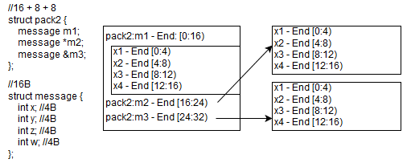
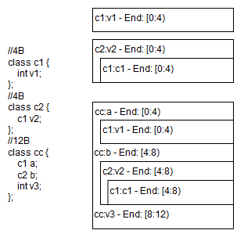

# Layout de memória de structs e classes

**Como a memória é alocada em structs e classes ?**

Seguindo o *post* de dependências entre *headers* ([Dependência cíclica de headers](https://github.com/SimplyCpp/posts/tree/master/14_Dependencia_ciclica_de_headers/Dependencia_ciclica_de_headers.md)).

Me perguntaram a razão do C++ não fazer o *demangling* dos  nomes simplesmente quando uma variável de classe é declarada e também  porque isso é diferente do Java, onde eu simplesmente coloco o nome da  classe e faço um *import*.

No C++ podemos ter as seguintes declarações de variáveis em uma classe/*struct*

```cpp
class router {
  message m1;
  message *m2
  message &m3;
}
```

Já é fato conhecido que a declaração de *m1* ficará na *stack* (pilha) e de *m2*/*m3* será um ponteiro. O tipo de alocação de *m1* é chamado de *value type*.

Mas como isso fica **alocado** em memória ?

Vamos criar uma classe *message* e dois *packs* e em seguida verificar o tamanho deles (supondo arquitetura 64-bit)

```cpp
//16B
struct message {
  int x; //4B
  int y; //4B
  int z; //4B
  int w; //4B
};

//16B
struct pack1 {
  message m1;
};

//16 + 8 + 8
struct pack2 {
  message m1;
  message *m2;
  message &m3;
};

std::cout << sizeof(pack1) << std::endl; //16
std::cout << sizeof(pack2) << std::endl; //32
```

Vemos entender isso agora.

Estamos supondo que os endereços no desenho abaixo são relativos aos endereços alocados.



Veja que cada tipo dentro de uma *struct* é adicionado por completo. Como o compilador precisa saber o tamanho exato de um tipo para poder colocá-lo dentro da *struct*, ele precisa fazer o *parsing* do arquivo. No caso da referência ou do ponteiro, somente é alocado o **tamanho de um ponteiro** (*sizeof(void\*)*).

Isso é o que permite o *forward declaration* quando se é um  ponteiro ou uma referência, já que o único tamanho que o  compilador precisa saber é o tamanho de um ponteiro, este que é sempre o mesmo.

## Estruturas aninhadas

Como ficaria uma estrutura aninhada então ?



Conforme falamos acima, o compilador coloca os tipos alinhados. Repare pelos *offsets* na imagem que não há qualquer *byte* desperdiçado!