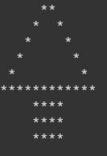
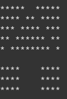
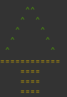

# Desacoplamento e composição

Ho ho ho! Feliz Natal !!!

Estava pensando em fazer algo com o tema natalino, mas que também  fosse interessante para o dia-a-dia e me veio uma coisa na cabeça:  Desenhar com caracteres ASCII uma imagem. Na hora pensei num algoritmo,  formato e tudo o mais, e em seguida comecei a fazer algo que é muito  natural para mim, desacoplar as funções.

## Primeiro passo – definindo um formato

O formato que eu imaginei é
Sendo que quantidade = 0 seria quebra de linha. Vejamos o exemplo:

```cpp
/* Xmas tree
     **
    *  *
   *    *
  *      *
 *        *
************
    ****
    ****
    ****
*/
string img =
    "5 2*00"
    "4 1*2 1*00"
    "3 1*4 1*00"
    "2 1*6 1*00"
    "1 1*8 1*00"
    "&lt;*00"
    "4 4*00"
    "4 4*00"
    "4 4*00";
```

E agora precisamos de uma função para carregar e uma struct

```cpp
struct command {
    command(char count, char pencil) :
        count(count), pencil(pencil) { }
    char count;
    char pencil;
};

vector<command> load(const string &img) {
    vector<command> v;
    for(auto it = img.begin(); it != img.end(); ++it) {
        char count = (*it) - '0';
        ++it;
        char pencil = *it;
        v.push_back(command(count, pencil));
    }
    return std::move(v);
}
```

E uma para fazer o desenho a partir de um vector

```cpp
void draw_cmd(const command &cmd) {
    if( cmd.count == 0 ) {
        putc(10, stdout);
    }
    for(int i=0; i < cmd.count; ++i) {
        putc(cmd.pencil, stdout);
    }
}

void draw(const vector<command> &img) {
    for(auto &c : img)
        draw_cmd(c);
}
```

Temos o nosso código pronto, mas tem um problema grave! Este código é extremamente acoplado. Vou listar o que está acoplado no que:

- load -> string, vector, command
- draw -> draw_cmd, vector, command
- draw_cmd -> putc, command

Existirem acoplamentos, não significa necessariamente que eu precise acabar com todos, mas **todo o código que puder ser genérico, deve ser genérico**. Vou explicar algumas razões para deixar o código desacoplado.


1. Se eu resolver ao invés de escrever no terminal com putc, gerar uma string ou um HTML, ou qualquer outra coisa, não consigo.
1. Se eu quiser, ao invés de command, usar algo com cor, por exemplo, não consigo.
1. Eu não consigo, por exemplo, gerar um plotter que desenhe espelhado.

Vamos começar a soltar as amarras!

Para mostrar o quanto um exemplo simples desse pode ser extensível,  vamos usar as funções draw_cmd e draw. No caso, vamos remover o putc e  passar um std::function

```cpp
void plot(char c) { putc(c, stdout); }

void draw_cmd(const command &cmd, function<void(char)> f_plot) {
    if( cmd.count == 0 ) {
        f_plot(10);
    }
    for(int i=0; i < cmd.count; ++i) {
        f_plot(cmd.pencil);
    }
}
```

Agora podemos passar a função plot ou qualquer outra para o `draw_cmd`. Vamos agora tirar a função `draw_cmd` e command da função draw

```cpp
template<typename SequenceContainer, typename DrawFunction>
void draw(SequenceContainer &img, DrawFunction f_draw) {
    for(auto &c : img)
        f_draw(c);
}
```

Simples e fácil. Para completar, como ficaria a chamada ?

```cpp
vector<command> v = load(img);
auto console_draw = [](command cmd) {
    draw_cmd(cmd, plot);
};
draw(v, console_draw);
```

E ainda dá para brincar um pouco mais:

```cpp
auto inverse_draw = [](command cmd) {
    if( cmd.pencil == ' ' )
        cmd.pencil = '*';
    else
        cmd.pencil = ' ';
    draw_cmd(cmd, plot);
};

auto funny_draw = [](command cmd) -> void {
    if( cmd.pencil != ' ' ) {
        if( cmd.count > 2 )
            cmd.pencil = '=';
        else
            cmd.pencil = '^';
    }
	draw_cmd(cmd, [](char c) -> void {
		if( c == '^' )
			cout << "\033[13;32m" << c;
		else if( c == '=' )
			cout << "\033[12;33m" << c;
		else
			cout << c;
        });
};
```

Vejam só como ficaram:







Espero que tenham gostado !

Ah, o tema natalino… Essa é uma árvore de natal !

Fonte:

- [draw.cpp](https://github.com/SimplyCpp/posts/blob/master/20_Desacoplamento_e_composicao/draw.cpp)
- [draw2.cpp](https://github.com/SimplyCpp/posts/blob/master/20_Desacoplamento_e_composicao/draw2.cpp)