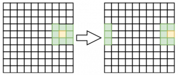
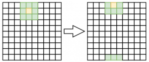

# Having fun in life!

Eu estava falando com um amigo sobre autômato celular dando como  exemplo o Conway’s Game of Life. Isso aguçou a minha curiosidade e  depois de tantos anos que vi isso pela última vez, li o artigo da  Wikipedia e achei fascinante.

Qual a melhor forma de aprender mais sobre o algoritmo?  Implementando! Porém, eu não queria fazer uma simples e tediosa  implementação. Mas vamos primeiro falar um pouco sobre esse famoso e  fascinante jogo “0-player”.


### Regras

(fonte Wikipedia):

As regras são simples e elegantes:

1. Qualquer célula viva com menos de dois vizinhos vivos morre de solidão.
1. Qualquer célula viva com mais de três vizinhos vivos morre de superpopulação.
1. Qualquer célula morta com exatamente três vizinhos vivos se torna uma célula viva.
1. Qualquer célula viva com dois ou três vizinhos vivos continua no mesmo estado para a próxima geração.

É importante entender que todos os nascimentos e mortes ocorrem  simultaneamente. Juntos eles constituem uma geração ou, como podemos  chamá-los, um “instante” na história da vida completa da configuração  inicial.

## E como fazer ?

Agora, vamos definir o que queremos implementar

### Estrutura de dados para a matriz

Muitas implementações usam estruturas como matrix[x][y], usando  vector de vector, mas tem dois problemas que podem ocorrer nessas  implementações:

1. Memória não sequencial. O primeiro vector é só um vetor de ponteiros
2. É entediante e carece de abstração. Mesmo sendo simples de  implementar, se eu quiser rotacionar a matrix ou mudar qualquer coisa  nela eu não consigo fazer facilmente.

Uma outra possibilidade é usar um vetor simples e calcular a posição  usando a formula y*cols+x, mas isso é suscetível a erros, então eu quero esse cálculo dentro da estrutura.

### Matrix view

Para cada célula, eu preciso verificar as células que a rodeiam,  porém lidar com índices é suscetível a erros e muito chato. Eu quero,  então, criar uma “view” da matriz e quero que essa view faça a rotação  automática se chegar em alguma aresta limite da matriz.

Rotacionando no eixo X



Rotacionando no eixo Y



### Decompondo a regra e o tipo de dado

Existem algumas implementações usando boleanos, inteiros, structs,  etc. Eu quero que o tipo de dados seja abstrato e dependente da regra,  não do processador life. Para isso preciso que o meu processador life  receba a regra e a contagem de células.

## Writing the code

Vamos ao código !

### Implementando a Matrix

Nós estamos abstraindo o tipo e o armazenamento. Vamos usar vector como padrão

```cpp
template<typename Type, typename Storage=std::vector<Type>>
struct matrix {
    Storage data;
    int cols, rows;
```

Para deixar isso mais interessante, vamos desabilitar cópia e usar move constructor e move assignment

```cpp
//... Constructor and boiler-plate code ...
matrix(int cols, int rows) : data(cols*rows), cols(cols), rows(rows) { }
 
matrix(const matrix& o) = delete; //disable copy
matrix(matrix&& o) : data(std::move(o.data)), cols(o.cols), rows(o.rows) { }
 
matrix& operator=(const matrix& other) = delete; //disable copy
matrix& operator=(matrix&& other)
{
    data = std::move(other.data);
    cols = other.cols;
    rows = other.rows;
    return *this;
}
```

E finalmente, vamos pegar a célula pela posição. Estou retornando uma referência para conseguir a bela sintaxe de matrix(x, y) = value;

```cpp
Type _get_pos(int x, int y) const {
    return x + (y*cols);
}
 
Type& operator () (int x, int y) {
    return data[_get_pos(x,y)];
}
 
const Type& operator() (int x, int y) const {
    return data[_get_pos(x,y)];
}
 
bool valid(int x, int y) const {
    return _get_pos(x,y) < data.size();
}
```

### implementing the matrix view

Este código tem muito menos boiler plate e é mais legal de se implementar.

Agora vamos abstrair o tipo e receber uma referência da matrix.

```cpp
template<typename Type>
struct matrix_view {
    matrix<Type> &_data;
    const int _x, _y;
    const int cols, rows;
     
    matrix_view(matrix<Type> &data, int x, int y, int cols, int rows) :
    _data(data), _x(x), _y(y), cols(cols), rows(rows) { }
```

Agora nós precisamos calcular o índice real baseado no virtual e  rotacionar para o outro lado caso o limite seja passado. Com isso eu  simplifico muito a vida de quem está usando a matrix_view.

```cpp
Type _get_x(int x) const {
    int rx = _x + x;
    if( rx >= _data.cols ) { rx -= _data.cols; }
    if( rx < 0 ) { rx += _data.cols; }
	return rx;
}

Type _get_y(int y) const {
	int ry = _y + y;
	if( ry >= _data.rows ) { ry -= _data.rows; }
    if( ry < 0 ) { ry += _data.rows; }
    return ry;
}

Type& operator () (int x, int y) {
    return _data(_get_x(x), _get_y(y));
}
```

### Implementing the life processor

Primeiro eu preciso receber de fora a regra, contador e tipo da  célula. Além disso, eu não posso mudar a mesma instância da matriz que  eu estou processando pois todas as operações ocorrem simultaneamente.  Para deixar isso interessante e minimizar cópia, eu vou trocar a matriz  recebida com uma interna.

```cpp
//The life processor don't know cell types. It's the processor and counter dependent
template <typename Rule, typename Counter, typename CellType>
struct life_processor {
     
    matrix<CellType> _nm; //internal matrix used to calculate and swap
    Rule _rule;
    Counter _counter;
     
    life_processor(const matrix<CellType> &v) : _nm(v.cols, v.rows) {
    }
```

Para cada iteração, eu preciso, célula por célula, contar as outras cercando e aplicar as regras.

```cpp
matrix<CellType> step(matrix<CellType> &m) {
    for(int y=0; y < m.rows; ++y) {
        for(int x=0; x < m.cols; ++x) {
            auto mv = get_surrounding(m, x, y);
            int count = _counter(mv);
             
            //Let's apply the rules
            _nm(x, y) = _rule(mv, count);                
        }
    }
```

E ao invés de copiar, vamos trocar e mover para deixar ainda mais rápido!

```cpp
std::swap(m, _nm);
return std::move(m);
```

### Implementando as regras e o contador

Primeiro vamos implementar uma função para pegar as celular ao redor. Com matrix_view isso fica muito simples.

```cpp
template<typename T>
matrix_view<T> get_surrounding(matrix<T> &data, int x, int y) {
    matrix_view<T> mv(data, x-1, y-1, 3, 3);
    return std::move(mv);
}
```

E agora eu vou implementar o contador. A responsabilidade dele é contar quantas células vivas nós temos na view

```cpp
//life_counter and life_rule are specific to int type.
struct life_counter {
    int operator() (matrix_view<int> &mv) {
        int total = 0;  
        for(int y=0; y < mv.rows; ++y) {
            for(int x=0; x < mv.cols; ++x) {
                //Let's not count itself
                if(x == 1 && y == 1) {
                    continue;
                }
                 
                if( mv(x, y) != 0 )
                    total += 1;
            }
        }
        return total;
    }
};
```

Agora é hora de implementar as regras. Para deixar isso mais  interessante, ao invés de inverter o valor (1 | 0), vamos manter a idade da célula.

```cpp
struct life_rule {
 
    int increase_until(int val, int max) {
    ++val;
    if( val > max ) return max;
        return val;
    }
     
    int operator() (matrix_view<int> &view, int count) {
        int cur_cell = view(1, 1);
         
        //Any live cell with two or three live neighbours lives on to the next generation.
        if( cur_cell != 0 && (count == 2 || count == 3) ) {
            //To make it interesting, let's increase generation
            return increase_until(cur_cell, 10);
        }
         
        //Any dead cell with exactly three live neighbours becomes a live cell, as if by reproduction.
        if( cur_cell == 0 && count == 3 ) {
            //Baby cell !
            return 1;
        }
         
        //Any live cell with fewer than two live neighbours dies, as if caused by underpopulation.
        //Any live cell with more than three live neighbours dies, as if by overpopulation.
        return 0;
    }
```

Eu estou quase terminando. Temos o processor, a regra e contador. Só  falta preencher a matriz com valores aleatórios e invocar o processador. A função auxiliar está no arquivo de exemplo.

```cpp
matrix<int> v(cols, rows);
fill_random(v);
 
auto life = get_life(v);
while(true) {
    show_matrix(v);
    v = life.step(v);
}
```


Eu espero que você tenha gostado o tanto quanto eu gostei de escrever!

- Código fonte – [life.cpp on github](https://github.com/SimplyCpp/posts/blob/master/21_Having_fun_in_life/life.cpp)
- Wikipedia – [Conway’s Game of Life](https://en.wikipedia.org/wiki/Conway's_Game_of_Life)